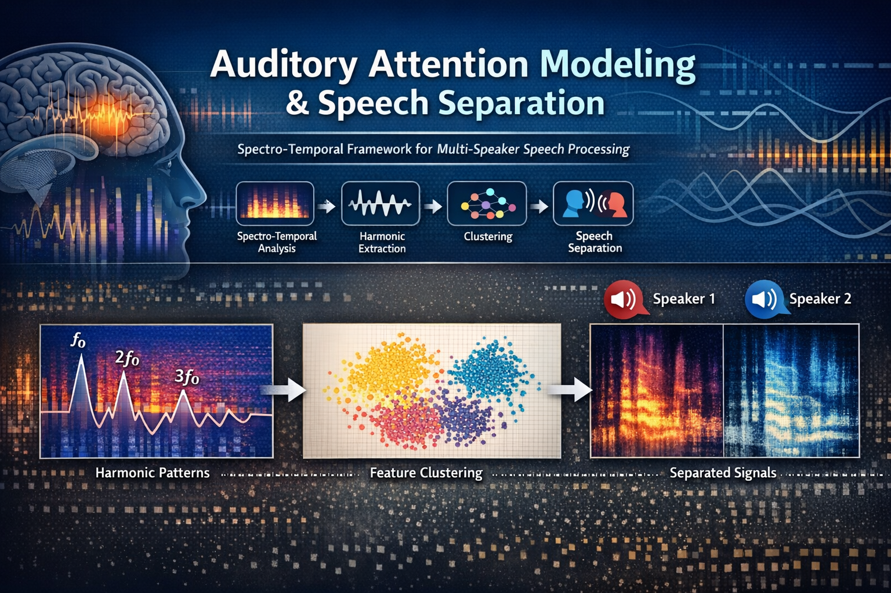

# Auditory Attention Modeling & Speech Separation



A biologically inspired spectro-temporal framework for modeling auditory attention and separating concurrent speech signals (the cocktail party problem).

## Overview

This repository contains the code, paper material, and project assets for an M.Sc. thesis project on auditory attention modeling using spectro-temporal analysis, harmonic structure extraction, cortical representation, and clustering-based speech stream segregation.

## Main Components

- **MATLAB implementation** of the proposed pipeline
- **NSL Tools** dependency bundled under `matlab/external/nsltools`
- **IEEE-style paper package** under `paper/`
- **Project assets** for GitHub presentation under `assets/`

## Repository Structure

See `TREE.txt` for the full project tree.

## Requirements

- MATLAB R2018+ recommended
- Signal Processing Toolbox
- Statistics and Machine Learning Toolbox

## Quick Start

```matlab
cd('matlab')
add_project_paths
run_demo
```

Or run the main pipeline directly:

```matlab
outputs = run_attention_pipeline( ...
    'data/audio/beshno.wav', ...
    'data/templates/templat.mat', ...
    32, 44100, 100, 'results');
```

## Method Summary

1. Spectrogram estimation
2. Harmonic pattern extraction
3. Spectro-temporal decomposition
4. Feature reduction
5. K-means clustering
6. Temporal tracking
7. Speech reconstruction

## Paper

The LaTeX source is available in `paper/main.tex`, and a compiled PDF is provided in `paper/pdf/paper.pdf`.

## Notes

- Original thesis code is preserved in `matlab/legacy/`.
- A cleaner presentation-oriented implementation is placed in `matlab/src/`.
- This repository is research-oriented and is not optimized for real-time deployment.

## Author

**Mohammad Reza Shirkhan**

## Supervisors

- Dr. Farbod Rezazi
- Dr. Mohammad Hassan Ghasemian Yazdi

## Contact

r.shirkhan@gmail.com
